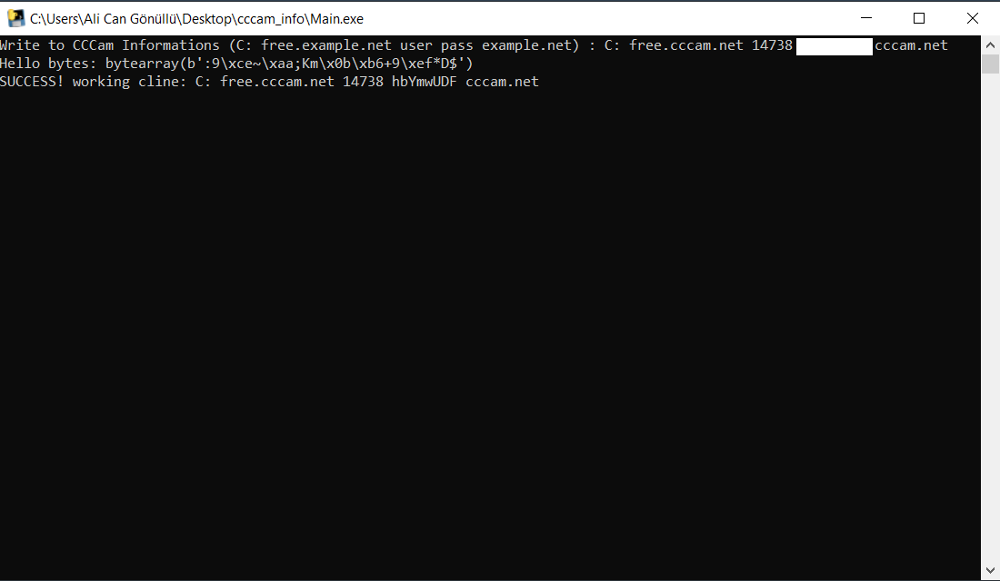

# cccam-tester-windows
<b>CCCam Tester for Windows</b>
<pre>Linux sunucuda herhangi bir CCCam Keycard server varsa, kullanıcı adı ve şifre denemesi yapabileceğiniz araç</pre>

Usage : C: server_ip usr pwd domain (if you have)keydata

  

  
